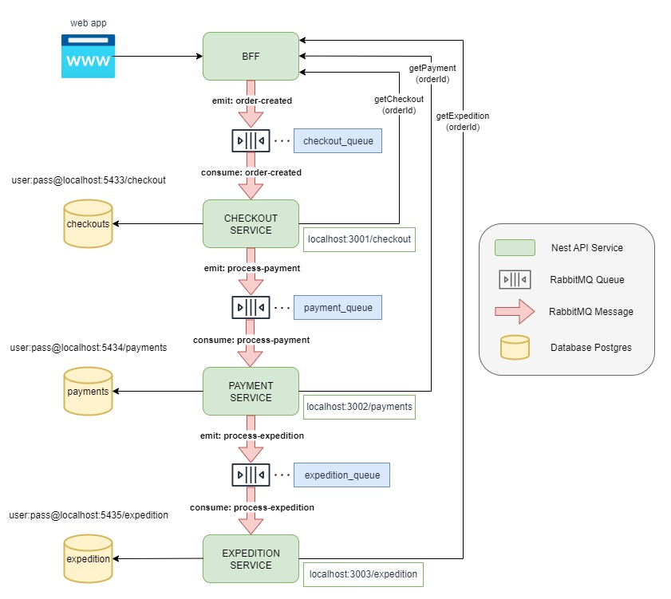

# Ecommerce Microservices



Este projeto implementa uma arquitetura de microsserviços com **NestJS**, utilizando **RabbitMQ** como broker de mensagens e **PostgreSQL** como banco de dados. Todos os serviços são orquestrados via **Docker Compose**.

---

## Serviços

* `bff` – Backend For Frontend
* `checkout` – Serviço de checkout
* `payments` – Serviço de pagamentos
* `expedition` – Serviço de expedição
* `rabbitmq` – Broker de mensagens
* `postgres_*` – Bancos de dados isolados para cada serviço (checkout, payments, expedition)

---

## Pré-requisitos

* [Docker](https://www.docker.com/)
* [Docker Compose](https://docs.docker.com/compose/)

---

## Como executar o projeto

### 1. Clone o repositório e entre na pasta

```bash
git clone https://github.com/ghbertuzzo/ecommerce-microservices.git
cd ecommerce-microservices
```

### 2. Configure os arquivos de ambiente

Você também pode configurar um `.env.prod` para produção. 
Obs: Os arquivos .env não estão no gitignore somente para demonstração e facilitar a subida do ambiente.

---

### 3. Suba os containers com Docker Compose Passando o .env como parâmetro

Você pode buildar as imagens com --build antes de subir os containers caso necessite alguma alteração, e/ou com o parâmetro -d para não travar o terminal onde esta executando.
```bash
docker-compose --env-file .env.dev up --build -d
```


---

## Acessos locais

| Serviço               | URL                                              |
| --------------------- | ------------------------------------------------ |
| BFF                   | [http://localhost:3000](http://localhost:3000)   |
| Checkout              | [http://localhost:3001](http://localhost:3001)   |
| Payments              | [http://localhost:3002](http://localhost:3002)   |
| Expedition            | [http://localhost:3003](http://localhost:3003)   |
| RabbitMQ UI           | [http://localhost:15672](http://localhost:15672) |
| PostgreSQL Checkout   | [http://localhost:5433](http://localhost:5433)   |
| PostgreSQL Payments   | [http://localhost:5434](http://localhost:5434)   |
| PostgreSQL Expedition | [http://localhost:5434](http://localhost:5435)   |
---

## Estrutura de Pastas

```plaintext
ecommerce-microservices/
├── bff/
├── checkout/
├── payments/
├── expedition/
├── docker-compose.yml
├── .env.dev
├── .env.prod
└── README.md
```

---
