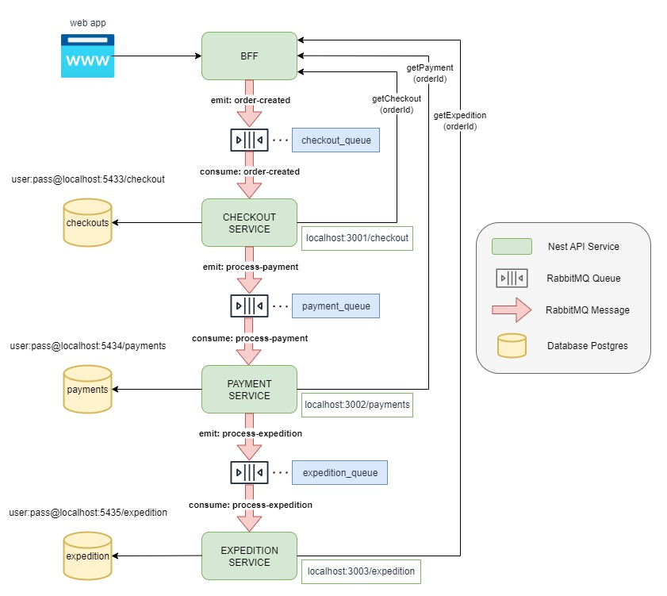
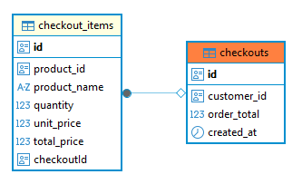
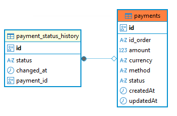
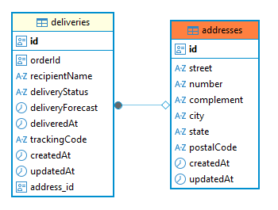

# Ecommerce Microservices

Este projeto implementa uma arquitetura de microsserviços com **NestJS**, utilizando **RabbitMQ** como broker de mensagens e **PostgreSQL** como banco de dados. Todos os serviços são orquestrados via **Docker Compose**.

## Arquitetura proposta



* A principal ideia foi isolar cada microserviço para funcionar de forma independente, com seu próprio banco de dados, sendo orquestrados pelo BFF.
* A imagem da arquitetura tem como objetivo refletir fielmente as configurações implementadas no código. Portanto, as strings de conexão, mensagens enviadas pelo RabbitMQ, nomes das filas e URLs dos serviços são reais, conforme definidos no ambiente de desenvolvimento (.env.dev).
* Embora os serviços principais (checkout, payments, expedition) estejam expostos diretamente via mapeamento de portas no `docker-compose`, e não estejam isolados em redes privadas ou específicas, isso foi feito apenas para facilitar testes e avaliação local. Em um ambiente de produção, apenas o serviço BFF estaria exposto à internet, enquanto os demais serviços permaneceriam restritos a uma rede interna. Essa decisão impacta outras estratégias de desenvolvimento, como as validações dos payloads e a escrita de testes unitários, que foram concentradas exclusivamente no BFF.

---

## Fluxo de execução

1 - Criação de novo pedido
* O serviço BFF é responsável por receber a requisição de um novo pedido, validar os dados e publicar a mensagem na fila para o serviço de checkout consumir.
* O serviço de checkout salva as informações relacionadas ao seu contexto e envia os dados restantes, acrescentando o ID do pedido gerado, para a fila do serviço de pagamento.
* O serviço de pagamento grava os dados no banco, processa o pagamento (de forma randômica: 50% aprovado / 50% rejeitado), atualiza o novo status no banco e, caso aprovado, publica a mensagem para o serviço de expedição. Se rejeitado, nada é publicado na fila de expedição.

2 - Consulta de pedido
* O serviço BFF é responsável por buscar os dados do pedido. Para isso, ele realiza chamadas assíncronas aos três serviços (checkout, payment, expedition) e agrega os dados.
* Se uma das chamadas falhar, os dados são retornados de forma parcial. Exemplo: caso o serviço de pagamento falhe, os dados de checkout e expedição ainda serão retornados normalmente.

---

## Serviços

* `BFF` – Backend For Frontend
* `checkout` – Serviço de checkout
* `payments` – Serviço de pagamentos
* `expedition` – Serviço de expedição
* `rabbitmq` – Broker de mensagens
* `postgres_*` – Bancos de dados isolados para cada serviço (checkout, payments, expedition)

---

## Entidades Banco de Dados

* Checkout: 


* Payments:


* Expedition:


* A configuração do ORM utilizado (TypeORM) está ajustada para sincronizar automaticamente o esquema do banco de dados com as definições das entidades (classes) no código.
* Isso elimina a necessidade de executar migrations. Essa configuração é voltada apenas para testes e não deve ser utilizada em ambiente produtivo.

---

## Pré-requisitos

* [Docker](https://www.docker.com/)
* [Docker Compose](https://docs.docker.com/compose/)
* [Node.js](https://nodejs.org/pt)

---

## Como executar o projeto

### 1. Clone o repositório e entre na pasta

```bash
git clone https://github.com/ghbertuzzo/ecommerce-microservices.git
cd ecommerce-microservices
```
---

### 2. Suba os containers com Docker Compose passando o .env.dev como parâmetro


```bash
docker-compose --env-file .env.dev up --build -d
```
Você também pode configurar um `.env.prod` para produção. 
Obs: Os arquivos .env não estão no gitignore somente para demonstração e facilitar a subida do ambiente.

### 3. Finalizar os containers com Docker Compose down 
Obs: Se você passar o parâmetro -v ele remove os dados persistidos nos volumes, ou seja da próxima vez que subir, ele vai criar com as tabelas zeradas
```bash
docker compose down -v
```

---

## Testes

### 1. Como o serviço BFF é o orquestrador da aplicação, somente ele possui testes unitários, para execução entre na pasta bff e siga os passos abaixo:

```bash
# Entre na pasta do projeto
cd bff

# Instale as dependências
npm install

# Rode os testes
npm run test
```

## Acessos locais

| Serviço               | URL                                                    |
| --------------------- | ------------------------------------------------------ |
| BFF                   | [http://localhost:3000](http://localhost:3000)         |
| BFF-Swagger           | [http://localhost:3000/api](http://localhost:3000/api) |
| Checkout              | [http://localhost:3001](http://localhost:3001)         |
| Payments              | [http://localhost:3002](http://localhost:3002)         |
| Expedition            | [http://localhost:3003](http://localhost:3003)         |
| RabbitMQ UI           | [http://localhost:15672](http://localhost:15672)       |
| PostgreSQL Checkout   | [http://localhost:5433](http://localhost:5433)         |
| PostgreSQL Payments   | [http://localhost:5434](http://localhost:5434)         |
| PostgreSQL Expedition | [http://localhost:5435](http://localhost:5435)         |
---

## Documentação e Envio de requisições

Este projeto utiliza o [**Swagger**](https://swagger.io/) para documentar e testar os endpoints da API BFF de forma interativa.

Após iniciar a aplicação, acesse a URL abaixo no navegador:
[http://localhost:3000/api](http://localhost:3000/api)

Nessa interface você pode:
- Visualizar todos os endpoints disponíveis.
- Conferir exemplos de payloads de entrada e saída.
- Realizar requisições diretamente pela interface web.

### 1. Criar novo pedido (via BFF)

- **Método:** `POST`  
- **URL:** `http://localhost:3000/orders/order`  
- **Descrição:** Cria um novo pedido e inicia o fluxo entre os microserviços.  
- **Payload (JSON):**

```json
{
  "customer_id": "db308891-5c33-4ef0-a458-b7d9b8ae5b1f",
  "payment_method": "CREDIT_CARD",
  "items": [
    {
      "product_id": "db308892-5c33-4ef0-a458-b7d9b8ae5b1f",
      "product_name": "Caipirinha de Limão",
      "quantity": 2,
      "unit_price": 18.5
    },
    {
      "product_id": "db308892-5c33-4ef0-a458-b7d9b8ae5b1f",
      "product_name": "Gin Tônica",
      "quantity": 1,
      "unit_price": 25.0
    }
  ],
  "recipientName": "João da Silva",
  "deliveryForecast": "2025-08-01T15:00:00Z",
  "address": {
    "street": "Rua do São Paulo",
    "number": "123",
    "complement": "Apto 202",
    "city": "São Paulo",
    "state": "SP",
    "postalCode": "04567-890"
  }
}
```

Via cURL

```bash
curl -X POST http://localhost:3000/orders/order -H "Content-Type: application/json" -d "{\"customer_id\":\"db308891-5c33-4ef0-a458-b7d9b8ae5b1f\",\"payment_method\":\"CREDIT_CARD\",\"items\":[{\"product_id\":\"db308892-5c33-4ef0-a458-b7d9b8ae5b1f\",\"product_name\":\"Caipirinha de Limão\",\"quantity\":2,\"unit_price\":18.5},{\"product_id\":\"db308892-5c33-4ef0-a458-b7d9b8ae5b1f\",\"product_name\":\"Gin Tônica\",\"quantity\":1,\"unit_price\":25.0}],\"recipientName\":\"João da Silva\",\"deliveryForecast\":\"2025-08-01T15:00:00Z\",\"address\":{\"street\":\"Rua do São Paulo\",\"number\":\"123\",\"complement\":\"Apto 202\",\"city\":\"São Paulo\",\"state\":\"SP\",\"postalCode\":\"04567-890\"}}"
```

### 2. Consultar dados de um pedido (via BFF)

- **Método:** `GET`  
- **URL:** `http://localhost:3000/orders/order/:id`  
- **Descrição:** Retorna os dados agregados do pedido a partir dos três serviços.
- **Observação:** Substitua :id pelo UUID do pedido.

### 3. Listar todos os checkouts (via BFF)

- **Método:** `GET`  
- **URL:** `http://localhost:3000/orders/checkout`  
- **Descrição:** Lista todos os pedidos de checkout processados no sistema.

### 4. Listar todos os pagamentos (via BFF)

- **Método:** `GET`  
- **URL:** `http://localhost:3000/orders/payments`  
- **Descrição:** Lista todos os pagamentos processados no sistema.

### 5. Listar todos as expedições (via BFF)

- **Método:** `GET`  
- **URL:** `http://localhost:3000/orders/expedition`  
- **Descrição:** Lista todas as expedições processados no sistema.
  
---

### Acesso direto aos serviços (consultas individuais)

### 1. **Checkout:**

- **Método:** `GET`
- **URL:** `http://localhost:3001/checkout/order/:id`
- **Descrição:** Retorna os dados de checkout do pedido
- **Observação:** Substitua :id pelo UUID do pedido.

### 2. **Payments:**

- **Método:** `GET`  
- **URL:** `http://localhost:3002/payments/order/:id`  
- **Descrição:** Retorna os dados de pagamento do pedido
- **Observação:** Substitua :id pelo UUID do pedido.

### 3. **Expedition:**

- **Método:** `GET`  
- **URL:** `http://localhost:3003/expedition/order/:id`  
- **Descrição:** Retorna os dados de expedição do pedido.
- **Observação:** Substitua :id pelo UUID do pedido.
